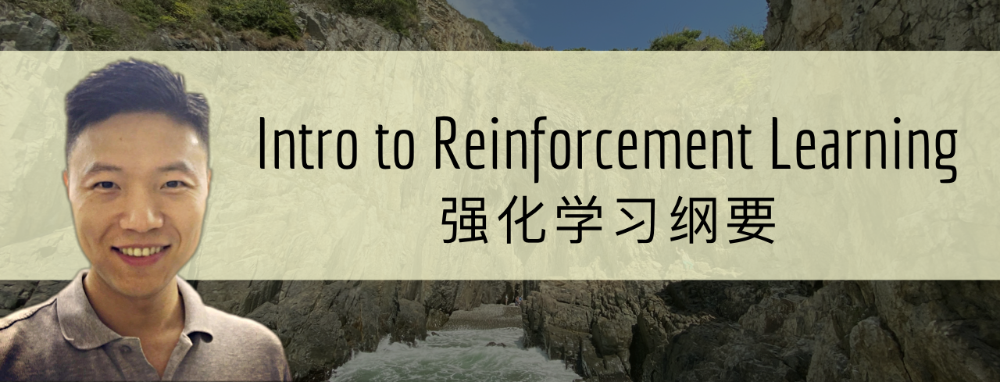

## Overview
This short RL course introduces the basic knowledge of reinforcement learning. Slides are made in English and lectures are given by [Bolei Zhou](http://bzhou.ie.cuhk.edu.hk/) in Mandarin. The course is for personal educational use only. Please open an issue if you spot some typos or errors in the slides. 

## Course Schedule
The course is scheduled as follows. There are 10 lectures in total, where the first one was premiered on 16 March 2020 and the last one was finished on 25 May 2020. Thanks for watching and may ReinForce be with you!

|            	  | Topic                                      	  | Resources |
|--------------	|----------------------------------------------	|----------	|
|  Lecture1 	| Overview (课程概括与RL基础)                                   	|[slide](lecture1.pdf), Youtube([part1](https://www.youtube.com/watch?v=IkEF4LpH5Ys), [part2](https://www.youtube.com/watch?v=Qu8CPnnwplM)), B站([上集](https://www.bilibili.com/video/BV1LE411G7Xj/), [下集](https://www.bilibili.com/video/BV1g7411Z7SJ/))  |
|  Lecture2 	| Markov Decision Process (马尔科夫决策过程)                    	| [slide](lecture2.pdf), Youtube([part1](https://www.youtube.com/watch?v=6yE9XiIB3hQ), [part2](https://www.youtube.com/watch?v=MIZbocCu7Sk)), B站([上集](https://www.bilibili.com/video/BV1g7411m7Ms/), [下集](https://www.bilibili.com/video/BV1u7411m7rh/)) |
|  Lecture3 	| Model-free Prediction and Control (无模型的预测和控制)          	|  [slide](lecture3.pdf), Youtube([part1](https://www.youtube.com/watch?v=Duj1U73yHik), [part2](https://www.youtube.com/watch?v=sfkhinBjGGY)), B站([上集](https://www.bilibili.com/video/BV1N7411Q7aJ/), [下集](https://www.bilibili.com/video/BV1N7411Q7M6/)) |
|  Lecture4 	| Value Function Approximation (价值函数近似)               	|[slide](lecture4.pdf), Youtube([part1](https://www.youtube.com/watch?v=YdWsnB-u8PQ), [part2](https://www.youtube.com/watch?v=fGIaFlbBFxk)), B站([上集](https://www.bilibili.com/video/BV11V411f7bi/), [下集](https://www.bilibili.com/video/BV1w54y1d7se/))  |
|  Lecture5 	| Policy Optimization: Foundation (策略优化基础篇)             |[slide](lecture5.pdf), Youtube([part1](https://www.youtube.com/watch?v=ProKaoyduFY), [part2](https://www.youtube.com/watch?v=MWXazkQkTlk)), B站([上集](https://www.bilibili.com/video/BV1fZ4y1x7mp/), [下集](https://www.bilibili.com/video/BV1ia4y1x7Va/))            	|
|  Lecture6 	| Policy Optimization: State of the art (策略优化进阶篇)      	|[slide](lecture6.pdf), Youtube([part1](https://youtu.be/4YIdjLh-MJs), [part2](https://youtu.be/HOpiQWM0PCA)), B站([上集](https://www.bilibili.com/video/BV1s64y1M7AW/), [下集](https://www.bilibili.com/video/BV1EK41157fD/))  |
|  Lecture7 	| Model-based RL (基于环境模型的RL)                             	|[slide](lecture7.pdf), [Youtube](https://youtu.be/2Cy8ZX16pBU), [B站](https://www.bilibili.com/video/BV1hV411d7Sg/)|
|  Lecture8 	| Imitation Learning (模仿学习)                         	|[slide](lecture8.pdf), [Youtube](https://youtu.be/Sqvn6RxU8qk), [B站](https://www.bilibili.com/video/BV17k4y1k7Gu/)           	|
| Lecture9 	| Distributed systems for RL (分布式系统) 	|[slide](lecture9.pdf), [Youtube](https://youtu.be/PyHGeFFfaWk), [B站](https://www.bilibili.com/video/BV1bi4y147Rv/)           	|
| Lecture10 	| RL in a nutshell (课程结局篇)|[slide](lecture10.pdf), [Youtube](https://youtu.be/bDGmKVKAdHg), [B站](https://www.bilibili.com/video/BV1si4y1s7oQ/)           	|
| Bonus 1 	| DeepMind's AlphaStar Explained (剖析星际争霸AI) by [Zhenghao Peng](https://github.com/pengzhenghao)|[slide](lecture_alphastar.pdf), [Youtube](https://youtu.be/5qp0VNC_iOc), [B站](https://www.bilibili.com/video/BV1wa4y1e74G/)           	|
